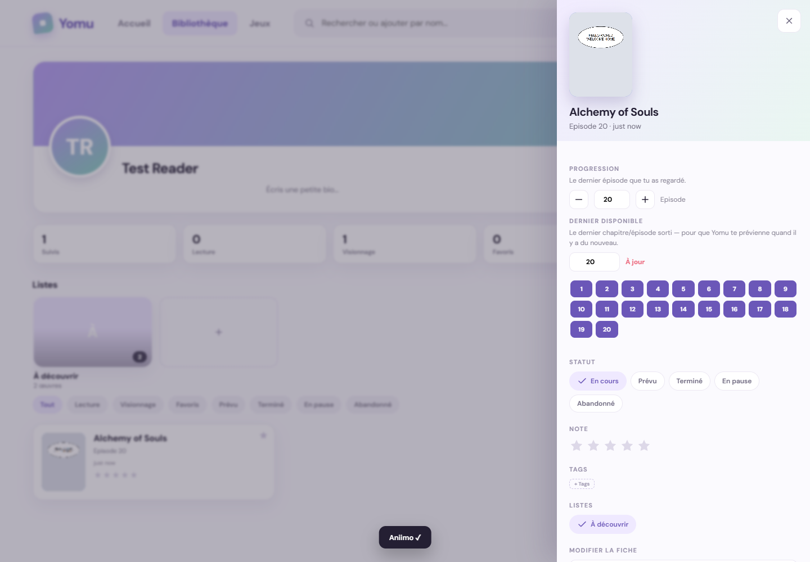
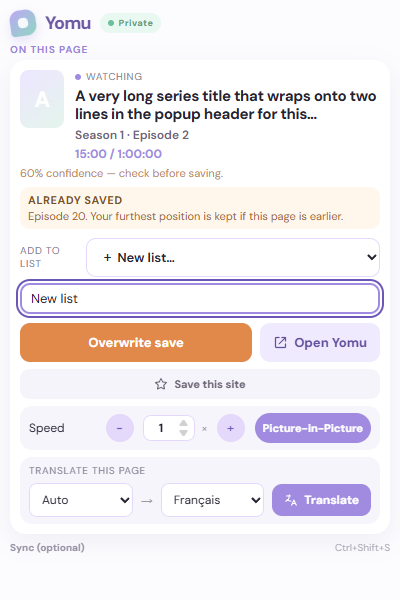
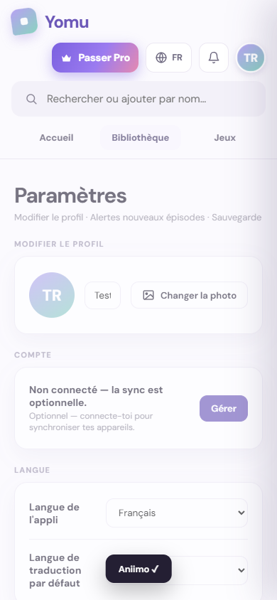
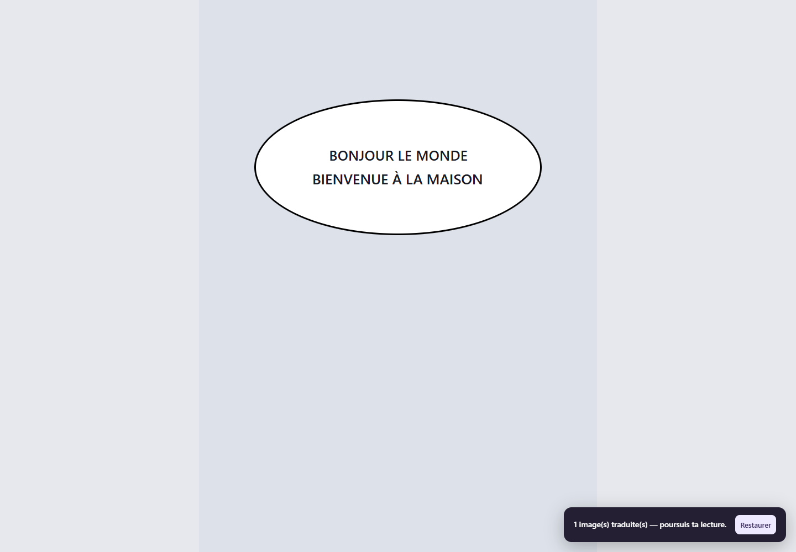

# Yomu — lot P0, 8 septembre 2026

Le travail porte sur le dépôt existant SUIVI-MANHWA-SHOWS-MANUS. Aucun nouveau dépôt n’a été créé. Ce lot corrige des blocages vérifiables ; il ne termine pas les 80 sections du cahier des charges et ne constitue pas une autorisation de commercialisation.

## Analyse initiale

Les captures fournies correspondent à la bibliothèque de l’extension, `library.html`. Le compagnon React constitue une seconde interface, avec un modèle moins complet. Il faut les distinguer pour éviter de corriger une page qui n’est pas celle utilisée.

- Les nouvelles sauvegardes tronquaient silencieusement la bibliothèque à 800 œuvres, et les imports à 2 000. Des écritures simultanées pouvaient s’écraser.
- La normalisation ASCII de l’import fusionnait des titres japonais et coréens sans rapport. Les imports mélangeaient les compteurs de saisons.
- Une recherche lente pouvait remplacer les résultats d’une recherche récente. Revenir à Library conservait parfois une grille filtrée vide.
- La traduction OCR renvoyait du texte sans placement dans les bulles. Un quota local était consommé dès le lancement, avant de connaître le résultat.
- Les ventes Steam incluaient du matériel et des doublons. L’autocomplétion manquait certains jeux à venir. Une date prévue passée devenait à tort une sortie confirmée.
- La popup dépassait la hauteur standard de Chrome. Le bouton favoris du hero React affichait une fausse sauvegarde et un faux conflit à un seuil arbitraire.
- La vérification TypeScript échouait. L’audit initial des dépendances de production signalait 71 avis, dont 15 élevés.

## Modifications et architecture

### Persistance et imports

Une file d’écriture commune protège les opérations de bibliothèque, listes, imports et la fusion locale de synchronisation. Les écritures asynchrones d’enrichissement relisent la version actuelle avant leur fusion. Les plafonds silencieux ont été supprimés : un dépassement réel du quota Chrome doit échouer explicitement, sans supprimer des œuvres pour faire de la place.

Les imports sont additifs, y compris les sauvegardes Yomu. Les identifiants importés sont associés aux identifiants retenus et les références des listes suivent cette correspondance. Les titres Unicode, les adaptations de types différents et les années de remake connues restent distincts. La progression est comparée à l’intérieur de sa saison. Les archives sont filtrées avant décompression : 25 Mo par fichier, 50 Mo cumulés décompressés et 1 000 entrées maximum.

La migration locale vers le schéma 3 préserve les collisions d’identifiants historiques, les références et une sauvegarde v1 avant transformation. Aucun compte ou réglage n’est remis à zéro lors d’une mise à jour. Les clés historiques `dasi.*` restent volontairement inchangées.

### Traduction

Le moteur Tesseract déjà embarqué renvoie désormais des zones avec coordonnées. Les longues images sont traitées par tuiles avec chevauchement. Un overlay positionné sur chaque image affiche les traductions ; l’image originale et sa mise en page restent intactes. Le bouton Restaurer retire les overlays. Les images suivantes sont traitées à leur entrée dans la zone de lecture. Les résultats récents sont conservés dans un cache mémoire borné. Les initialisations et reconnaissances OCR ont un délai maximal et un mécanisme de récupération.

L’anglais est ajouté aux modèles japonais, coréen et chinois simplifié. Le chemin courant ne demande ni clé ni serveur OCR à l’utilisateur. L’OCR courant est local ; les textes reconnus sont transmis au fournisseur de traduction. Le quota artificiel de cinq lancements est retiré. Cela ne signifie pas que le fournisseur réseau offre un service illimité ou garanti.

**Limites :** le masquage utilise un fond clair ou sombre échantillonné, sans véritable inpainting neuronal. Les textes verticaux, les polices stylisées, les bulles sur fond illustré et les pages protégées restent à qualifier sur un corpus autorisé. L’auto-sélection de langue est une heuristique de site/langue de page. Le fournisseur sans clé utilisé par le code existant n’offre pas ici de SLA contractualisé. Les anciens messages de traduction personnalisée restent pour compatibilité, mais ne sont pas le chemin courant.

### Recherche, interface et jeux

La recherche affiche son chargement dès la saisie, ignore les réponses périmées et propose une nouvelle tentative après échec total. Une couverture ouvre un aperçu avec synopsis et choix de liste avant ajout. Les cadres d’image sont bornés et la navigation réinitialise la grille. L’avatar ouvre les réglages. Le hero React possède maintenant une vraie bascule favoris.

La recherche Steam utilise la recherche du catalogue, filtre le matériel et déduplique les identifiants. Les rubriques reflètent leur source Steam ; elles ne représentent pas un classement mondial exhaustif. Le détecteur reconnaît les données JSON-LD de jeux et les sites officiels Aniimo et Chrono Odyssey. Une annonce de disponibilité nécessite une confirmation du fournisseur, et non simplement l’écoulement d’une date prévue.

### Serveur et dépendances

CORS est limité aux origines configurées et à l’origine du serveur. Le rate limiting utilise l’adresse déterminée par Express, sans accepter directement une IP forgée dans X-Forwarded-For. Les entrées de synchronisation sont validées et un plan payant transmis par le client n’est pas accepté. Les erreurs asynchrones sont traitées. En production, un secret de session robuste et une persistance explicite sont requis. Les certificats Postgres sont vérifiés.

Le stockage fichier écrit un fichier temporaire puis le renomme. Une écriture échouée ne devient pas l’état mémoire courant. Un fichier corrompu arrête le chargement au lieu d’être remplacé par une base vide.

Les dépendances ont été actualisées dans les plages compatibles, Vitest a migré vers la version corrigée 3.2.6 et qs est verrouillé à 6.16.0. Axios et Streamdown, inutilisés, sont retirés. pnpm 11.19.0 est utilisé localement et dans la CI ; le correctif existant de Wouter reste épinglé.

## Vérifications exécutées

| Vérification | Résultat local |
| --- | --- |
| `pnpm lint` | Réussi, contrôles de sûreté JavaScript ; TypeScript contrôlé séparément |
| `pnpm check` | Réussi |
| `pnpm test` | 140 tests, 15 fichiers, réussis |
| `pnpm build` | Réussi ; avertissement de chunk principal > 500 ko à traiter ultérieurement |
| `pnpm audit --audit-level=moderate` | Aucune vulnérabilité connue signalée après corrections |
| `pnpm test:e2e` | Chromium avec extension : recherche concurrente, aperçu, ajout à une liste, navigation, progression, profil, largeur mobile, popup chargée, vrai OCR anglais et japonais, image longue, overlay, restauration |
| `pnpm build:extension` | Archive 0.3.1 produite, manifeste à la racine, 27 fichiers comparés après décompression |
| Historique Git | 91 commits accessibles, recherche de formats GitHub/Stripe/OpenAI/AWS/clés privées : aucun résultat ; ce scan heuristique ne prouve pas l’absence de tout secret |

La popup mesurée avec titre long, progression précédente, faible confiance, vidéo et création de liste occupe 564 px pour une fenêtre de 600 px. Ce résultat ne couvre pas toutes les combinaisons possibles de langue, zoom et conflits.

Les tests E2E utilisent des catalogues déterministes et un résultat de traduction réseau simulé, **avec le vrai OCR embarqué**. Un essai réseau séparé a reconnu HELLO WORLD / WELCOME HOME et obtenu BONJOUR LE MONDE / BIENVENUE À LA MAISON. Le modèle japonais a également reconnu こんにちは世界 et le moteur a retrouvé une ligne placée au-delà de 2 300 pixels dans une image longue. Ces preuves sur images synthétiques lisibles ne valident pas tous les mangas japonais.

La recherche réelle Steam a renvoyé Aniimo (4126040). Le classement popularwishlist a renvoyé notamment Deadlock, Light No Fire et Fable ; aucun titre n’est codé en dur dans cette rubrique.

Les métadonnées des sites officiels Aniimo et Chrono Odyssey ont été consultées réellement dans Chromium. Le test automatisé de leurs adaptateurs utilise des fixtures DOM et un transport Chrome simulé, car activeTab nécessite un geste utilisateur. Les tests API utilisent un serveur HTTP local avec deux comptes distincts et vérifient leur isolation.

## Captures de vérification

## Sources et décisions

- [API Tesseract.js](https://github.com/naptha/tesseract.js/blob/master/docs/api.md) : demander explicitement les blocs OCR et conserver les coordonnées. Le moteur est embarqué, sans téléchargement de code à l’exécution.
- [Modèles tessdata_fast et licence](https://github.com/tesseract-ocr/tessdata_fast/blob/main/LICENSE) : modèle anglais ajouté, licence Apache conservée dans tesseract/LICENSE.tessdata. Les fichiers tiers déjà présents gardent leurs notices.
- [manga-image-translator](https://github.com/zyddnys/manga-image-translator) : référence de séparation détection/OCR/traduction/inpainting/rendu ; son serveur ne constitue pas un backend Yomu déployé.
- [Comic Translate](https://github.com/ogkalu2/comic-translate) et sa [licence](https://github.com/ogkalu2/comic-translate/blob/main/LICENSE) : pipeline plus spécialisé, licence Apache annoncée. Aucun code de ce projet n’est copié dans ce lot.
- [Koharu](https://github.com/koharu-rs/koharu) : piste de pipeline spécialisé ; licence et coûts de toutes ses dépendances/modèles non qualifiés pour une intégration. Pas de code repris.
- [Trakt API](https://github.com/trakt/trakt-api) : API et contrats structurés pour historique/listes ; l’import de fichiers reste local et ne constitue pas une intégration OAuth Trakt.
- [Chrome storage](https://developer.chrome.com/docs/extensions/reference/api/storage) : les quotas local/sync restent réels. La synchronisation Chrome limitée ne remplace pas un backend de compte.
- [Aniimo Steam](https://store.steampowered.com/app/4126040/Aniimo/), [site officiel](https://www.aniimo.com/fr), [Chrono Odyssey](https://chronoodyssey.kakaogames.com/) : sources de vérification, pas des contenus ajoutés artificiellement à la bibliothèque.

## Non terminé et prérequis avant publication

L’URL web utilisée et le backend déployé n’ont pas été fournis. Aucun déploiement, achat, paiement, envoi d’email ou publication Chrome Web Store n’a été effectué. La CI est ajoutée, mais son résultat distant doit être lu après création de la PR. Les règles de branche GitHub doivent rendre son contrôle obligatoire avant fusion ; le workflow seul ne crée pas cette protection.

Restent notamment : convergence du modèle web/extension (dont jeux et saisons), isolement local lors des changements de compte, suppressions synchronisées avec tombstones, révocation des sessions, suppression de compte, restauration d’une vraie sauvegarde de production, monitoring de sorties hors Steam, catalogue multi-sources serveur et recherche exhaustive, corpus OCR japonais/coréen avec qualité mesurée, fournisseur de traduction contractualisé et plafonds de coûts, refonte Discover/Library complète, cropper, personnalisation avancée, accessibilité exhaustive, veille concurrentielle et modèle économique documenté. Le document ne présente pas ces travaux comme réalisés.

## Trois prochaines priorités

1. Unifier les données et l’authentification web/extension, puis tester la synchronisation de comptes et les suppressions sur une instance de staging persistante.
2. Qualifier la traduction sur de vraies planches autorisées, ajouter un service géré pour les cas difficiles et mesurer qualité, latence et coût avant de vendre un quota.
3. Terminer le catalogue normalisé et les parcours Discover → fiche → liste pour dramas, mangas et jeux, puis la personnalisation et le pricing sur données vérifiées.
